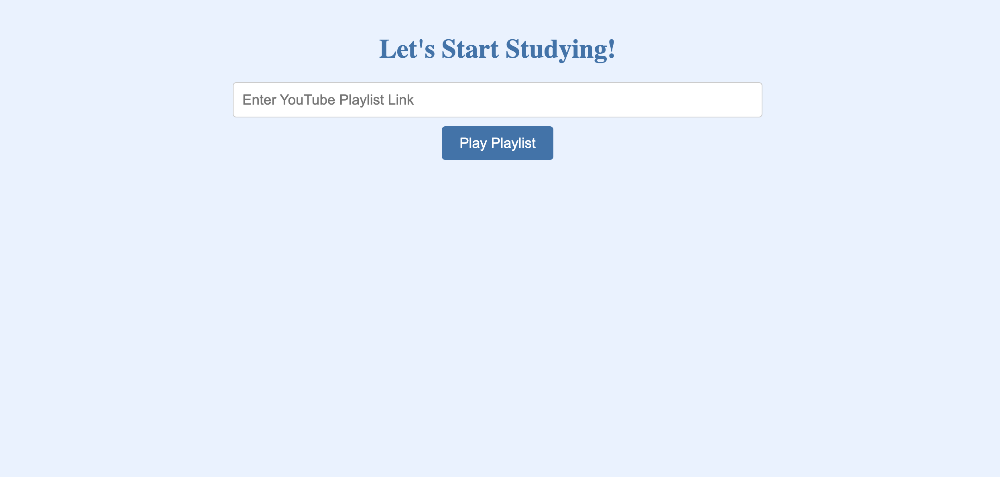
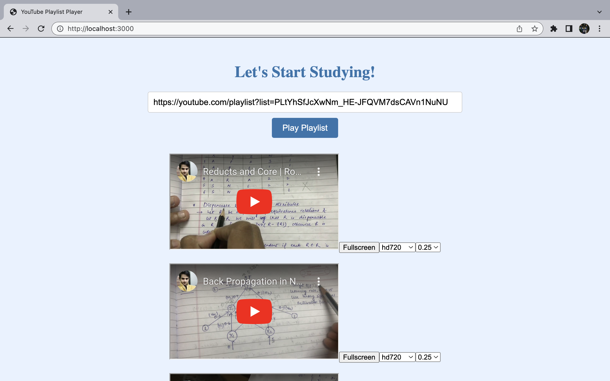

# YouTube Playlist Player

This project allows you to create a website that plays YouTube videos from a specified playlist. Users can enter a YouTube playlist link, and the website will display and play the videos from that playlist.

## Steps to Deploy the Website

1. **Obtain the YouTube Data API Key**: Follow these steps to get an API key for the YouTube Data API:
   - Go to the [Google Developers Console](https://console.developers.google.com/).
   - Create a new project or select an existing project.
   - Enable the YouTube Data API for your project.
   - Generate an API key.

2. **Set Up a Backend Server**: Choose a server-side programming language like Node.js, Python, or PHP to create a backend server. Here, we'll use Node.js as an example:
   - Install Node.js if you haven't already.
   - Create a new directory for your project.
   - Create a `server.js` file and copy the backend code provided in this project.

3. **Install Dependencies**: In the root directory of your project, run the following command to install the necessary dependencies:

4. **Update the Backend Code**: Replace the placeholder `'YOUR_API_KEY'` in the `server.js` file with the API key obtained in Step 1.

5. **Create the Frontend HTML File**: Create a new HTML file named `home.html` and copy the frontend code provided in this project.

6. **Customize the Frontend**: Modify the HTML, CSS, and JavaScript code in `home.html` to suit your design preferences. Feel free to update the styling, layout, and UI elements as desired.

7. **Connect the Frontend and Backend**: In `home.html`, update the API endpoint URL in the JavaScript code to match the backend server URL where you'll be running the server.

8. **Deploy the Website**: You can deploy the website using GitHub Pages by following these steps:
- Create a new repository on GitHub.
- Push the `home.html` and `server.js` files to the repository.
- Enable GitHub Pages in the repository settings, using the `master` branch as the source.
- Access your deployed website at `https://<username>.github.io/<repository_name>`.

9. **Add Screenshots of the Final Website**:

Enjoy studying with your YouTube playlist on the YouTube Playlist Player website! 🎉
## Screenshots

## Usage

1. Open the deployed website in a web browser.
2. Enter the YouTube playlist link in the input field and click the "Play Playlist" button.
3. The website will fetch the playlist data using the YouTube Data API and display the videos.
4. Use the video controls to play, pause, adjust volume, go to the next or previous video, and change video quality and playback speed.

## Contributing

Contributions are welcome! If you have any suggestions, bug reports, or feature requests, please open an issue or submit a pull request.

## License

This project is licensed under the [MIT License](LICENSE).

---
